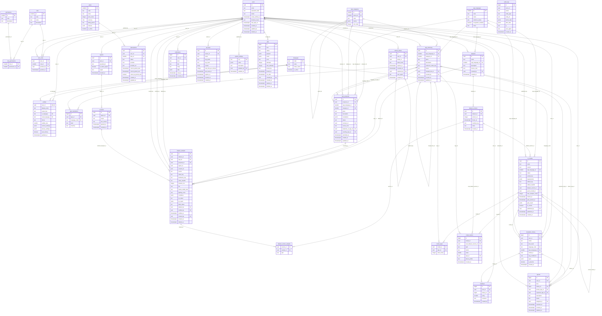

# ER-диаграмма (сгенерирована из db/migrations/0001_initial.sql)

Не редактируйте вручную: `python3 scripts/gen_er.py`.

```mermaid
erDiagram
  roles ||--o{ role_permissions : "role_id"
  permissions ||--o{ role_permissions : "permission_id"
  users ||--o{ user_roles : "user_id"
  roles ||--o{ user_roles : "role_id"
  users |o--o{ user_roles : "granted_by"
  users ||--o{ refresh_tokens : "user_id"
  refresh_tokens |o--o{ refresh_tokens : "replaced_by"
  users ||--o{ profiles : "user_id"
  languages ||--o{ profiles : "ui_language"
  languages ||--o{ profiles : "result_language"
  users ||--o{ subscriptions : "user_id"
  plans ||--o{ subscriptions : "plan_id"
  sign_categories |o--o{ sign_categories : "parent_id"
  sign_languages ||--o{ sign_dictionary : "sign_language_id"
  sign_categories |o--o{ sign_dictionary : "category_id"
  sign_dictionary |o--o{ sign_dictionary : "merged_into_id"
  users |o--o{ sign_dictionary : "created_by"
  sign_dictionary ||--o{ sign_translations : "sign_id"
  languages ||--o{ sign_translations : "language_code"
  users |o--o{ signers : "user_id"
  signers ||--o{ consents : "signer_id"
  users |o--o{ sign_proposals : "proposer_id"
  sign_languages ||--o{ sign_proposals : "sign_language_id"
  sign_categories |o--o{ sign_proposals : "category_id"
  users |o--o{ sign_proposals : "reviewer_id"
  sign_dictionary |o--o{ sign_proposals : "duplicate_of_sign_id"
  sign_dictionary |o--o{ sign_proposals : "resulting_sign_id"
  sign_languages ||--o{ datasets : "sign_language_id"
  users |o--o{ datasets : "created_by"
  datasets ||--o{ dataset_samples : "dataset_id"
  sign_dictionary |o--o{ dataset_samples : "sign_id"
  sign_proposals |o--o{ dataset_samples : "proposal_id"
  users |o--o{ dataset_samples : "labeled_by"
  users |o--o{ dataset_samples : "verified_by"
  users |o--o{ dataset_samples : "created_by"
  consents ||--o{ dataset_samples : "consent_id,signer_id"
  datasets ||--o{ dataset_versions : "dataset_id"
  dataset_versions ||--o{ dataset_version_samples : "version_id"
  dataset_samples ||--o{ dataset_version_samples : "sample_id"
  sign_languages ||--o{ ai_models : "sign_language_id"
  dataset_versions |o--o{ ai_models : "dataset_version_id"
  ai_models |o--o{ ai_models : "parent_model_id"
  users |o--o{ ai_models : "published_by"
  ai_models ||--o{ model_signs : "model_id"
  sign_dictionary ||--o{ model_signs : "sign_id"
  ai_models ||--o{ model_metrics : "model_id"
  dataset_versions |o--o{ model_metrics : "eval_dataset_version_id"
  sign_dictionary |o--o{ model_metrics : "sign_id"
  users ||--o{ translation_history : "user_id"
  languages ||--o{ translation_history : "language_code"
  sign_languages |o--o{ translation_history : "sign_language_id"
  ai_models |o--o{ translation_history : "model_id"
  users |o--o{ feedback : "user_id"
  translation_history |o--o{ feedback : "history_id"
  users |o--o{ reports : "user_id"
  translation_history |o--o{ reports : "history_id"
  sign_dictionary |o--o{ reports : "shown_sign_id"
  sign_dictionary |o--o{ reports : "expected_sign_id"
  users |o--o{ reports : "assigned_to"
  users ||--o{ notifications : "user_id"
  users ||--o{ api_keys : "owner_id"
  users |o--o{ system_settings : "updated_by"
  users |o--o{ jobs : "created_by"
  languages {
    text code PK
    text name
    text native_name
    boolean is_active
  }
  roles {
    smallint id PK
    text code
    text name
    text description
  }
  permissions {
    smallint id PK
    text code
    text description
  }
  role_permissions {
    smallint role_id FK
    smallint permission_id FK
  }
  users {
    uuid id PK
    text email
    text password_hash
    text status
    timestamptz email_verified_at
    text blocked_reason
    timestamptz last_login_at
    timestamptz created_at
    timestamptz updated_at
    timestamptz deleted_at
  }
  user_roles {
    uuid user_id FK
    smallint role_id FK
    uuid granted_by FK
    timestamptz granted_at
  }
  refresh_tokens {
    uuid id PK
    uuid user_id FK
    uuid family_id
    text token_hash
    timestamptz expires_at
    timestamptz revoked_at
    uuid replaced_by FK
    text user_agent
    timestamptz created_at
  }
  profiles {
    uuid user_id PK,FK
    text display_name
    text avatar_key
    text ui_language FK
    text result_language FK
    text theme
    smallint subtitle_size
    jsonb camera_settings
    jsonb privacy_settings
    boolean save_history
    timestamptz updated_at
  }
  plans {
    smallint id PK
    text code
    text name
    integer price_minor
    char currency
    text billing_period
    jsonb features
    boolean is_active
  }
  subscriptions {
    uuid id PK
    uuid user_id FK
    smallint plan_id FK
    text status
    text provider
    text provider_ref
    timestamptz current_period_start
    timestamptz current_period_end
    boolean cancel_at_period_end
    timestamptz created_at
    timestamptz updated_at
  }
  sign_languages {
    smallint id PK
    text code
    text name
    text evidence_status
    boolean recognition_enabled
    text notes
  }
  sign_categories {
    smallint id PK
    smallint parent_id FK
    text code
    jsonb names
    integer sort_order
  }
  sign_dictionary {
    uuid id PK
    smallint sign_language_id FK
    smallint category_id FK
    text gloss
    text description
    text reference_video_key
    text status
    uuid merged_into_id FK
    uuid created_by FK
    timestamptz created_at
    timestamptz updated_at
  }
  sign_translations {
    bigint id PK
    uuid sign_id FK
    text language_code FK
    text label
    text meaning
  }
  signers {
    uuid id PK
    uuid user_id FK
    text pseudonym
    boolean is_native_signer
    text region
    timestamptz created_at
  }
  consents {
    uuid id PK
    uuid signer_id FK
    text scope
    text text_version
    timestamptz granted_at
    timestamptz revoked_at
  }
  sign_proposals {
    uuid id PK
    uuid proposer_id FK
    smallint sign_language_id FK
    smallint category_id FK
    text gloss
    text description
    jsonb translations
    text status
    uuid reviewer_id FK
    text review_note
    uuid duplicate_of_sign_id FK
    uuid resulting_sign_id FK
    timestamptz submitted_at
    timestamptz created_at
    timestamptz updated_at
  }
  datasets {
    uuid id PK
    text name
    smallint sign_language_id FK
    text description
    text license_note
    uuid created_by FK
    timestamptz created_at
  }
  dataset_samples {
    uuid id PK
    uuid dataset_id FK
    uuid sign_id FK
    uuid proposal_id FK
    uuid signer_id
    uuid consent_id
    text source
    text video_key
    text landmarks_key
    text video_sha256
    integer duration_ms
    real fps
    real hands_visible_ratio
    real lighting_score
    jsonb conditions
    text qc_status
    jsonb qc_report
    text label_status
    uuid labeled_by FK
    uuid verified_by FK
    timestamptz verified_at
    uuid created_by FK
    timestamptz created_at
    timestamptz deleted_at
  }
  dataset_versions {
    uuid id PK
    uuid dataset_id FK
    integer version_no
    timestamptz frozen_at
    text manifest_key
    text notes
    timestamptz created_at
  }
  dataset_version_samples {
    uuid version_id FK
    uuid sample_id FK
    text split
  }
  ai_models {
    uuid id PK
    text name
    text version
    smallint sign_language_id FK
    text status
    text architecture
    jsonb hyperparams
    text artifact_key
    text artifact_sha256
    uuid dataset_version_id FK
    uuid parent_model_id FK
    integer train_samples_count
    timestamptz trained_at
    timestamptz gate_passed_at
    jsonb gate_report
    boolean is_current
    uuid published_by FK
    timestamptz published_at
    timestamptz created_at
  }
  model_signs {
    uuid model_id FK
    uuid sign_id FK
    integer class_index
  }
  model_metrics {
    bigint id PK
    uuid model_id FK
    uuid eval_dataset_version_id FK
    text split
    text metric
    double value
    uuid sign_id FK
    text device_profile
    timestamptz created_at
  }
  audit_logs {
    bigint id PK
    uuid actor_id
    text action
    text entity_type
    text entity_id
    jsonb before_data
    jsonb after_data
    inet ip
    text user_agent
    timestamptz created_at
  }
  translation_history {
    bigint id PK
    uuid user_id FK
    text mode
    text text_result
    text language_code FK
    smallint sign_language_id FK
    uuid model_id FK
    real avg_confidence
    jsonb signs
    boolean is_favorite
    timestamptz created_at
  }
  feedback {
    bigint id PK
    uuid user_id FK
    bigint history_id FK
    smallint rating
    text comment
    timestamptz created_at
  }
  reports {
    bigint id PK
    uuid user_id FK
    text kind
    bigint history_id FK
    uuid shown_sign_id FK
    uuid expected_sign_id FK
    text description
    text status
    uuid assigned_to FK
    timestamptz resolved_at
    timestamptz created_at
    timestamptz updated_at
  }
  notifications {
    bigint id PK
    uuid user_id FK
    text kind
    text title
    text body
    jsonb data
    timestamptz read_at
    timestamptz created_at
  }
  api_keys {
    uuid id PK
    uuid owner_id FK
    text name
    text key_prefix
    text key_hash
    text[] scopes
    integer rate_limit_per_minute
    timestamptz last_used_at
    timestamptz expires_at
    timestamptz revoked_at
    timestamptz created_at
  }
  system_settings {
    text key PK
    jsonb value
    text description
    uuid updated_by FK
    timestamptz updated_at
  }
  jobs {
    bigint id PK
    text kind
    text status
    jsonb payload
    jsonb result
    text error
    integer attempts
    integer max_attempts
    text locked_by
    timestamptz locked_at
    timestamptz run_after
    uuid created_by FK
    timestamptz created_at
    timestamptz started_at
    timestamptz finished_at
  }
```
